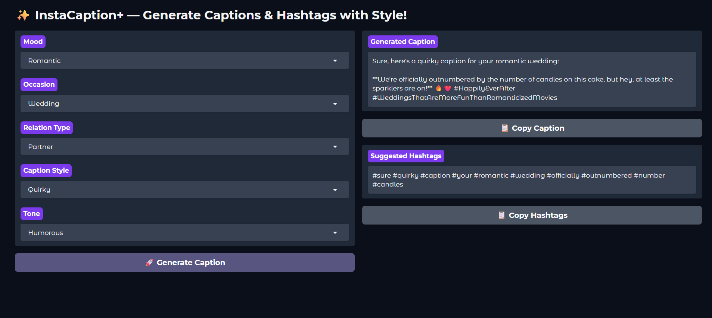

✨ InstaCaption+ — Caption & Hashtag Generator
A Python + Gradio web app that generates creative Instagram captions and relevant hashtags based on your chosen mood, occasion, style, tone, and relation type.
It uses the Ollama local LLM API with the gemma:2b model for fast, offline generation.
---
🖼 Demo Screenshot
<table> <tr> <td><b>App Interface</b></td> </tr> <tr> <td></td> </tr> </table>
---
⚙️ Features

- 🎯 Generate context-aware captions

- 🔖 Suggests relevant hashtags

- 🖱 One-click copy to clipboard

- 🎨 Simple & modern Gradio UI

- 🖥 Works offline with local LLM
---
🛠 Tech Used

- Python

- Gradio

- Ollama (gemma:2b)

- Requests library
---
🧪 How to Use

Step 1 — Clone the repository

- git clone https://github.com/diyanaikk/instacaption-plus.git
- cd instacaption-plus

- Step 2 — Install Python dependencies

- "pip install -r requirements.txt"
---
Step 3 — Install & Setup Ollama

- Download from: https://ollama.ai/download

- Install Ollama (it will also add it to your PATH)

- Pull the required model:

+ "ollama pull gemma:2b"
---
Step 4 — Start the app

- "python app.py"

+ Open the local URL shown in the terminal (e.g., http://127.0.0.1:7860)

+ Select options → Click Generate → Copy caption & hashtags
---

Step 5 — (Optional) Test Ollama API

- "python test_ollama.py"

---
🔖 License Disclaimer
This project uses the gemma:2b model via Ollama, which is distributed under its respective license.
Make sure to follow Ollama's terms when using the model.
---

👩‍💻 Author
Diya Naik
[@diyanaikk](https://github.com/diyanaikk)